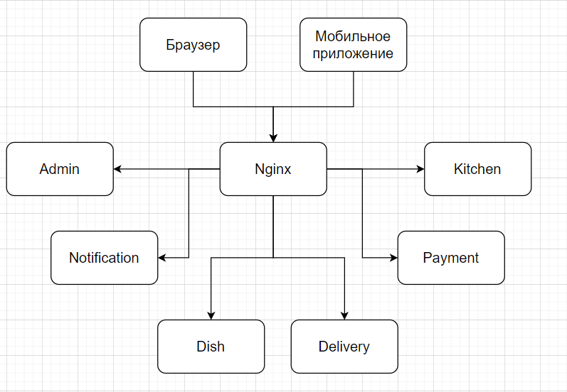
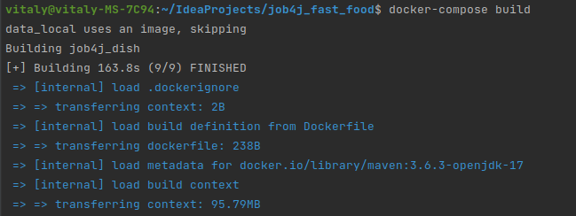
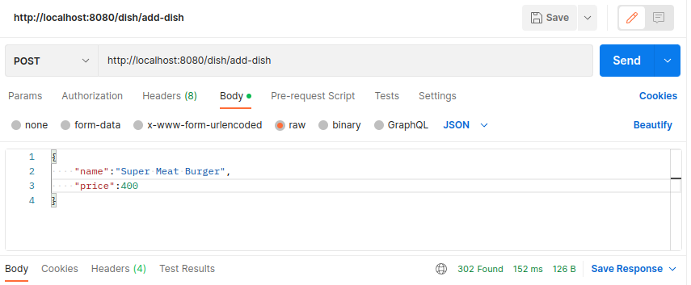

# job4j_fast_food

## Проект FastFood (Доставка еды)

## Использованные технологии

* Spring Framework 2.7.3
* PostgresSQL 42.5.1
* Liquibase 4.15.0
* Lombok 1.18.26
* Apache Kafka 
* Collections Framework

## Требование к окружению

* Docker
* Docker-compose
* Postman
* Java 17
* PostgresSQL 15
* Apache maven 3.8

## Структура проекта 

* Сервис имеет каталог блюд
* Сервис может принимать заказы на сайте, либо через скачанное клинтом приложение
* Сервис предоставляет клиенту курьерскую доставку. Клиент может отслеживать местоположение курьера
* Сервис предоставляет курьерам приложение, где они могу отчитываться о заказах
* Сервис имеет админку в виде веб приложения, где можно оформлять поставки продуктов, а также отслеживать прибыль

## Архитектура приложения <br><br>


## Запуск проекта 
1. Установить JDK 17
2. Установить Postman
3. Установить Maven
4. Установить Docker
5. Установить Docker-compose
6. Открыть терминал и перейти к папке проекта
7. Выполнить команду 
```shell
 docker-compose build
```

8. Выполнить команду
```shell
 docker-compose up -d
```
9. Для добавления нового блюда в меню, необходимо открыть Postman, на URL 
http://localhost:8080/dish/add-dish отправить POST запрос с телом для добавления блюда:

10. Для просмотра всех блюд, необходимо на URL http://localhost:8080/dish/get-all
отправить GET запрос:

11. Для завершения работы, необходимо в терминале - в папке проекта выполнить команду:
```shell
docker-compose down
```